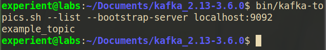
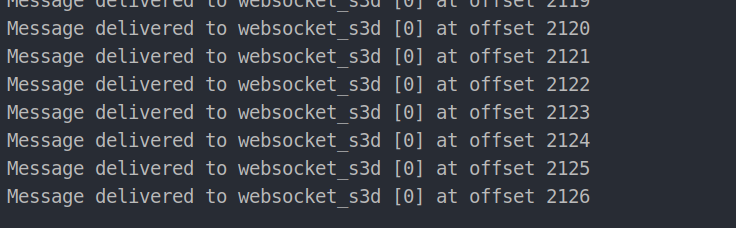
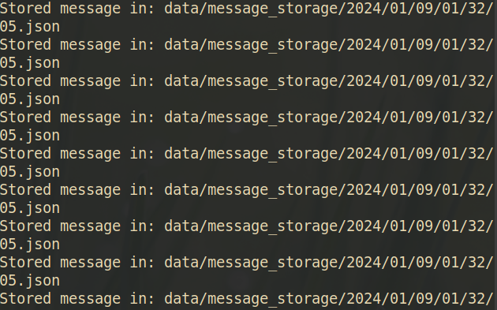

Libraries used for websocket
pip install websocket-client
pip install websockets

### How to kill websocket app 

1. Get the process id:
```
ps aux | grep python
```

2. Kill the process: 
```
kill -9 <pid>
```

## Note: Create a Topic Before Producing:
```shell
kafka-topics.sh --create --topic websocket_s3d --bootstrap-server localhost:9092 --partitions 1 --replication-factor 1
```


## List Kafka Topics
```shell
kafka-topics.sh --list --bootstrap-server localhost:9092

```



## Producing to kafka



